# Assessment Koemdigi

**Koemdigi Assessment** is a web-based application designed to showcase a company's profile and manage essential data such as products, articles, galleries, and clients.  
This application was developed as part of a final project assessment, offering comprehensive features for both **users** and **administrators**.

---

## 📌 Initial View

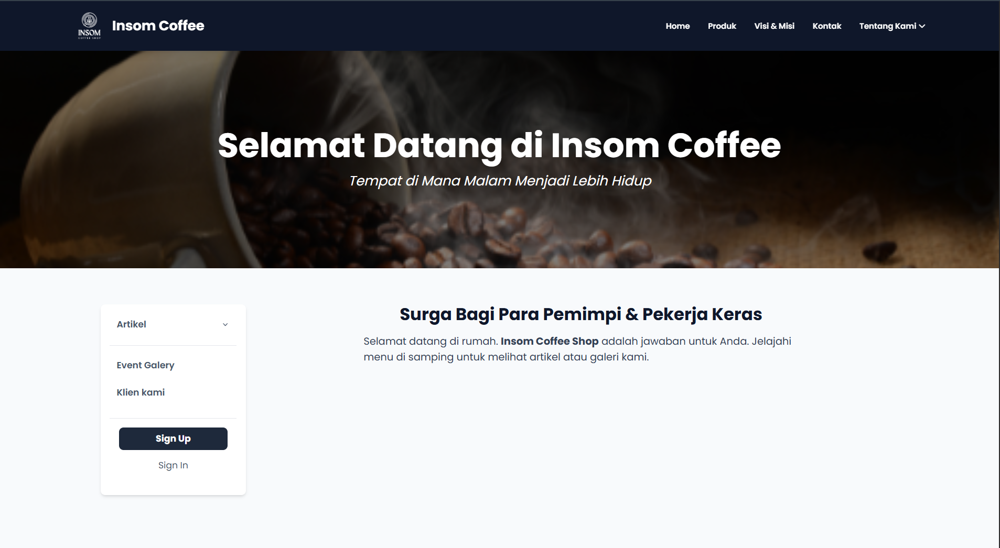

---

## ✨ Features

### 🔐 Authentication
- **Register Page**  
  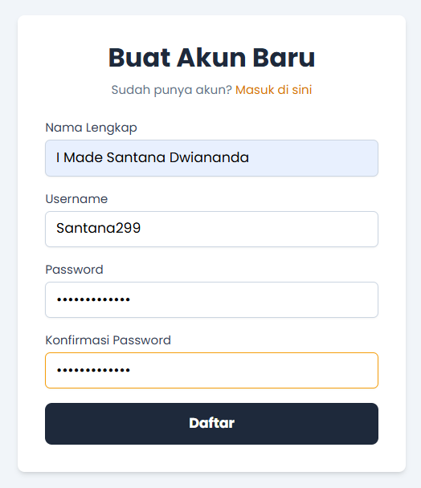

- **Login Page**  
  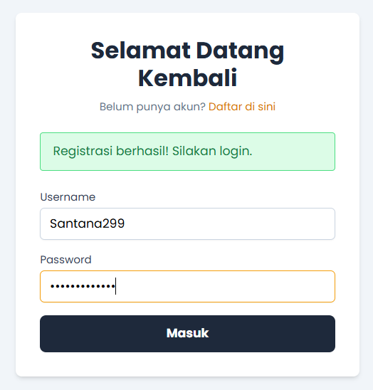

### 🗂️ Admin Features
- **Product Management**  
  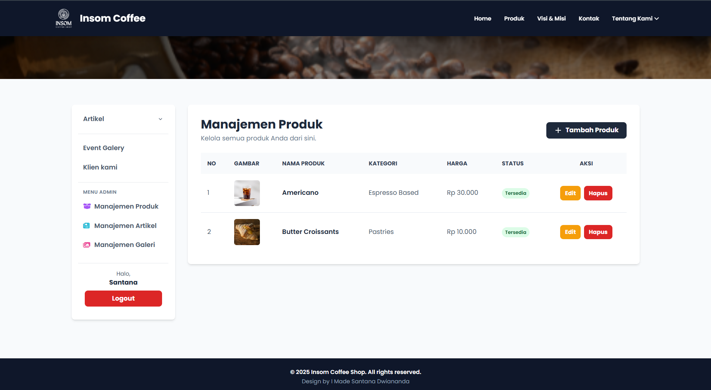

- **Article Management**  
  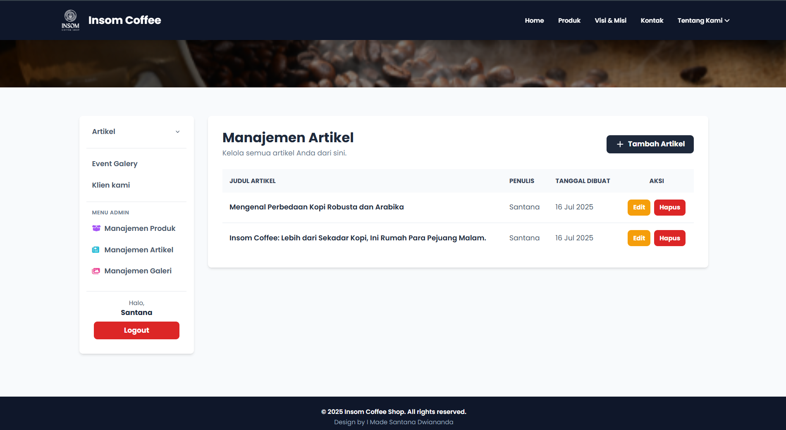

- **Gallery Management**  
  

- **Input Validation**

---

## 👥 User Menu

### 🏠 Home  
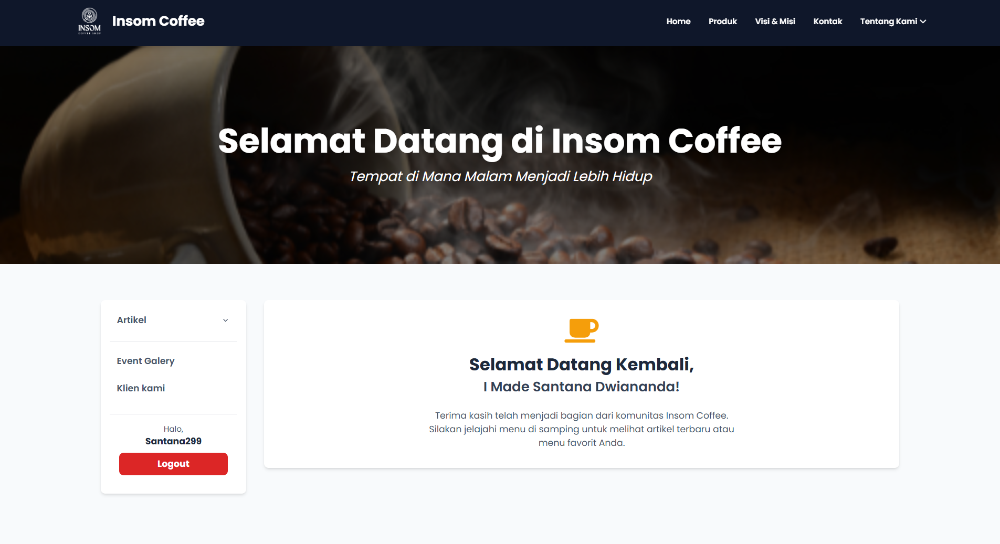

### 📦 Product  
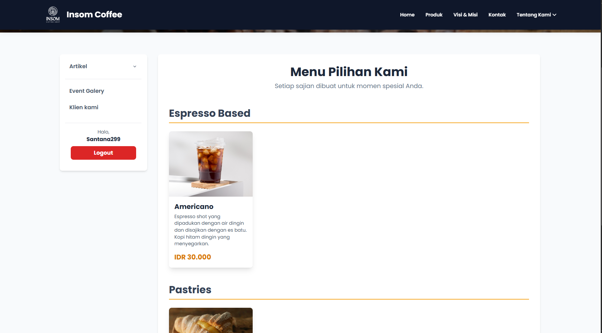

### 🎯 Vision & Mission  
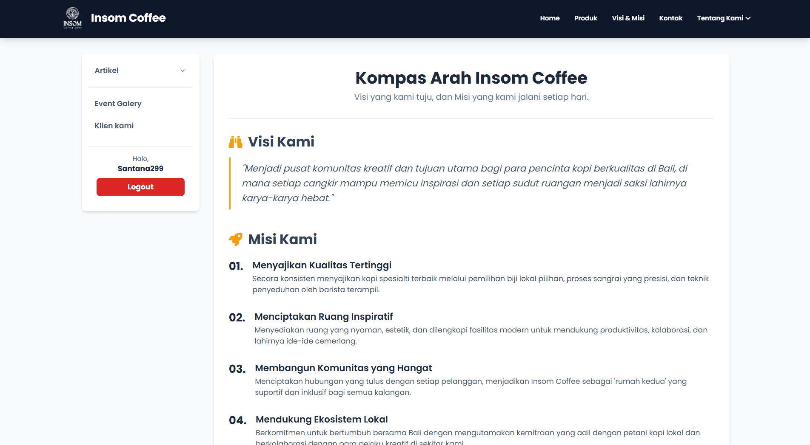

### 📞 Contact  
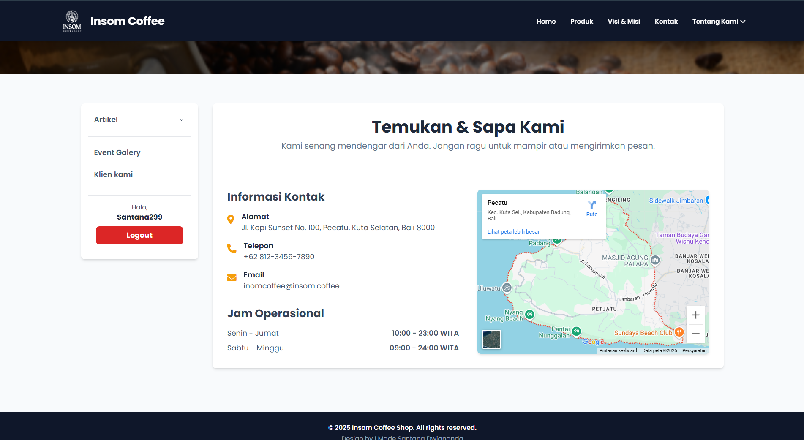

### 🏢 About Us
- **Company Profile**  
  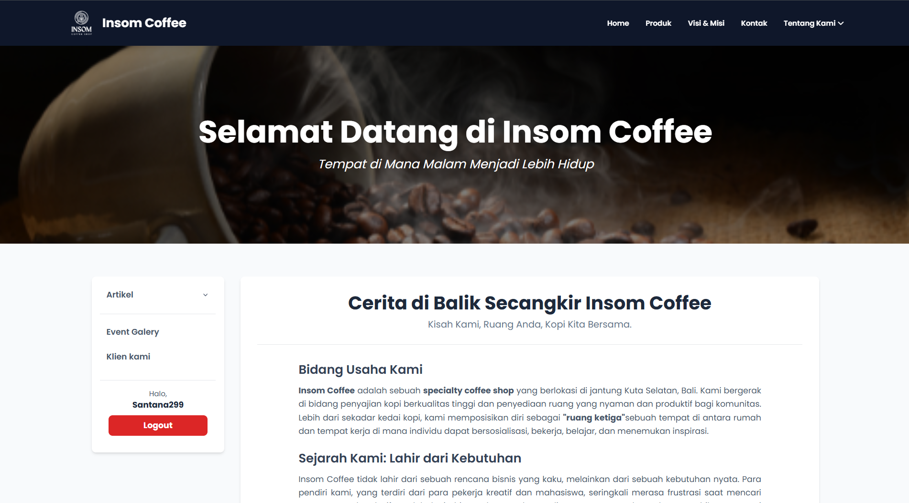

- **Experience**  
  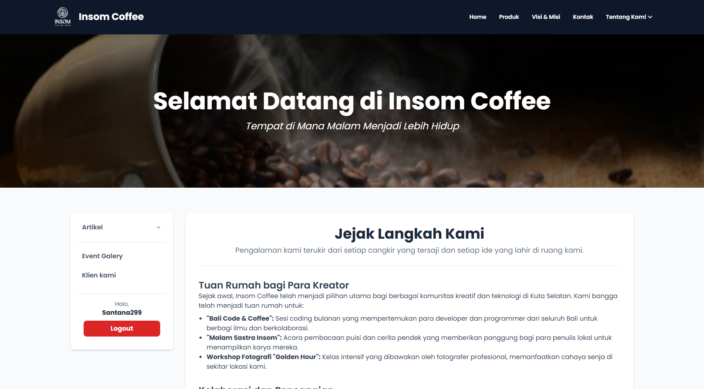

- **Our Advantages**  
  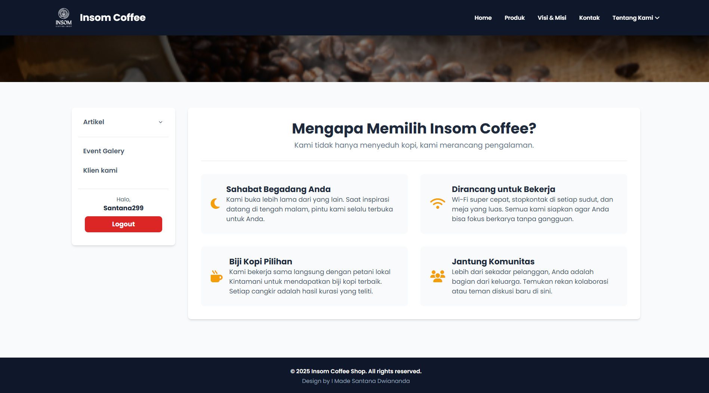

### 📚 Article  
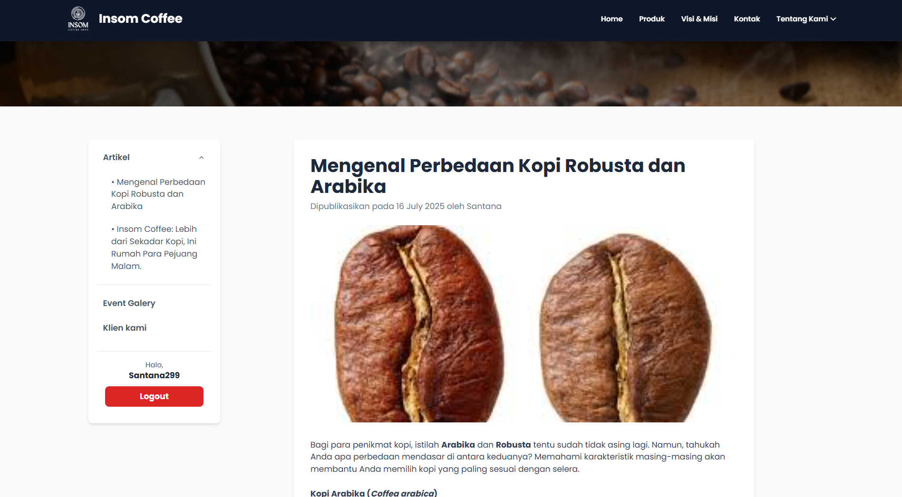

### 🖼️ Event Gallery  
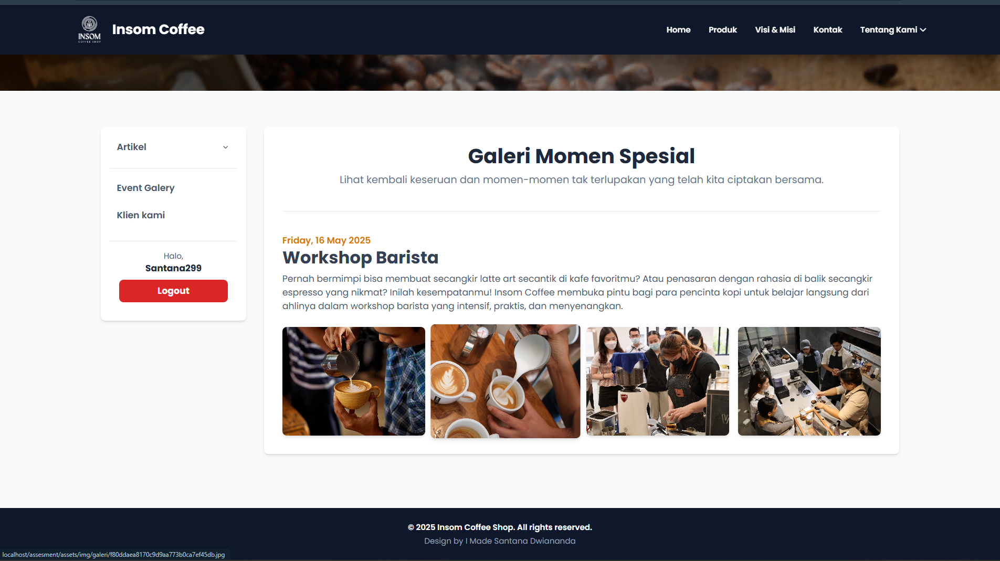

### 🤝 Our Clients  
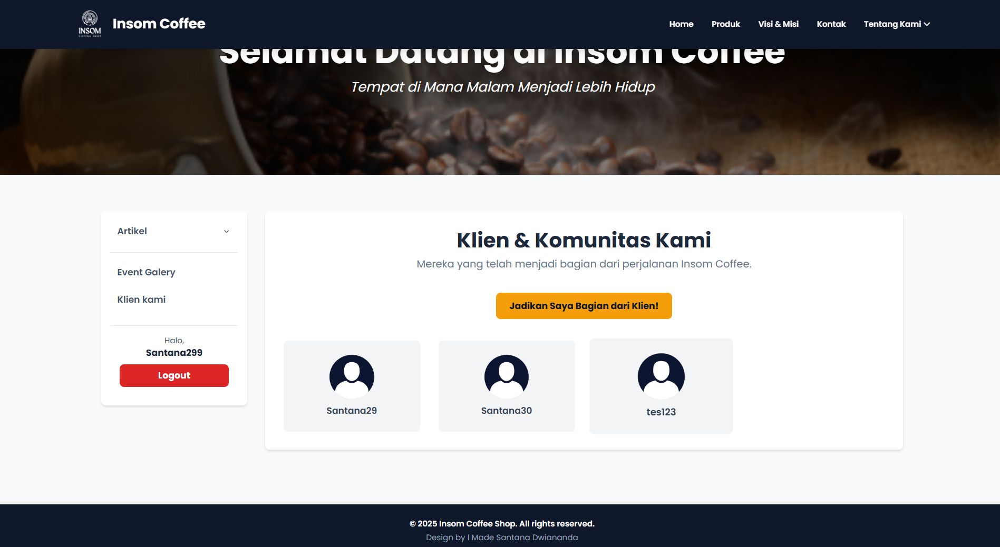

---

## 🛠️ Admin Dashboard

- **Dashboard Home View**  
  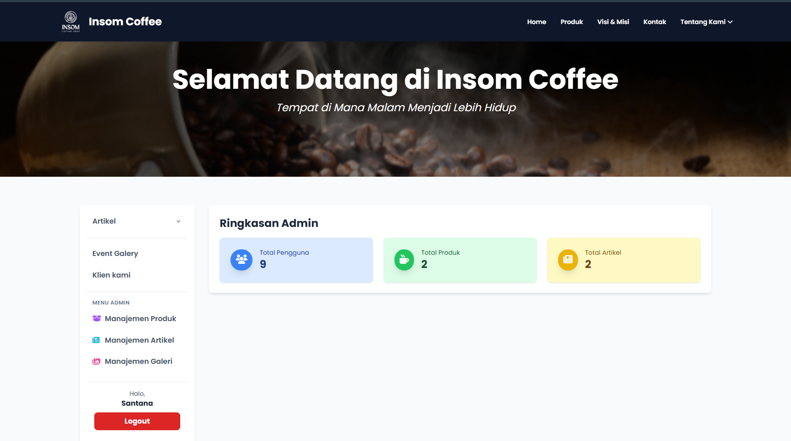

- **Product Management**  
  

- **Article Management**  
  

- **Gallery Management**  
  

---

## ⚙️ Technology Used

- **PHP** (CodeIgniter Framework)
- **MySQL**
- **Tailwind CSS**
- **jQuery**

---

## 👨‍💻 Credit

Created by **I Made Santana Dwiananda**  
_As part of the Koemdigi assessment certification project._

